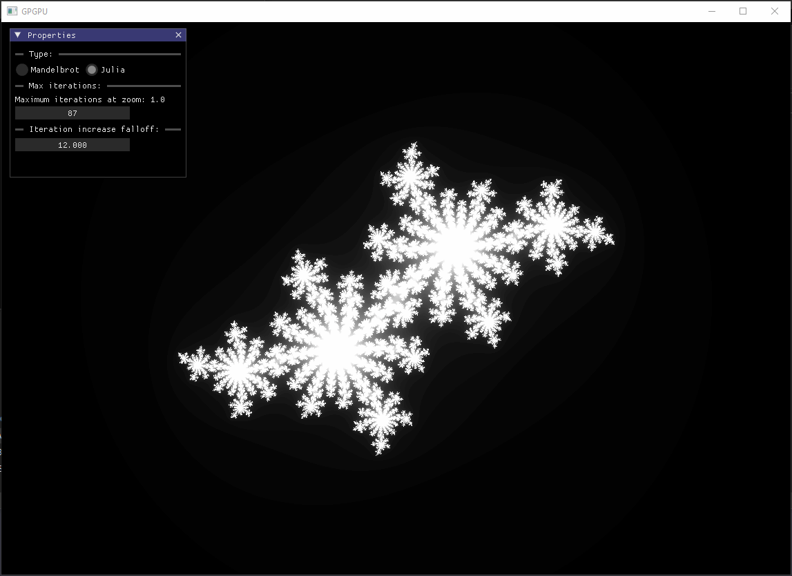
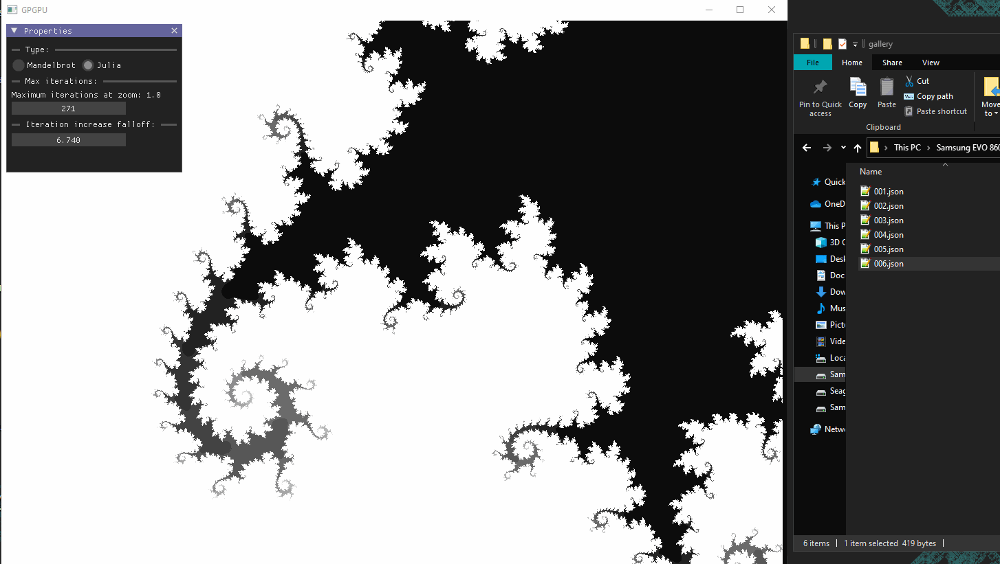

# Mandelbrot and Julia Set Renderer with CUDA, SDL, and ImGui


## Features

- **Dynamic Visualization:** Explore the Mandelbrot and Julia sets dynamically by adjusting parameters such as zoom, pan, and iteration count through the intuitive ImGui user interface.
- **CUDA Acceleration:** Leverage the power of CUDA for efficient computation of complex fractal patterns, ensuring swift and responsive rendering on compatible NVIDIA GPUs.
- **ImGui Integration:** Seamlessly interact with the program through ImGui, allowing users to set and manipulate fractal parameters in real-time.
- **Flexible Julia Set Rendering:** Set custom parameters for the Julia set, enabling exploration of a vast array of captivating fractal shapes.
- **Fractal State Persistence:** Save and load the current position in the fractal space, along with window properties, to a JSON file. This feature allows users to resume exploration exactly where they left off in previous sessions.
- **Drag and Drop JSON Import:** Import fractal parameters by dragging and dropping JSON files onto the application window.

<div style="page-break-after: always;"></div>

## System Requirements

- NVIDIA GPU with CUDA support
- CUDA Toolkit installed
- C++ compiler with CUDA support
- SDL library for graphics rendering
## Usage
The program integrates ImGui for a user-friendly interface, making it easy to adjust visualization parameters on the fly. Compile the provided source code with a C++ compiler supporting CUDA.

Explore the Mandelbrot and Julia sets with intuitive mouse interactions. Use the mouse wheel to zoom in or out dynamically, focusing on the area pointed to by the cursor. This allows for precise navigation within the fractal space.

**Note:** Due to the limitations of floating-point precision, extremely deep zoom levels may lead to numerical instability and visual artifacts.


<div style="page-break-after: always;"></div>

Modify the starting point $z_0$​ for the Mandelbrot set or the constant $c$ for the Julia set by left-click dragging within the window. This feature allows users to dynamically adjust the initial parameters of the fractals.




<div style="page-break-after: always;"></div>

Utilize the *Properties* window to control various aspects of the fractal visualization:
- **Switch between Mandelbrot and Julia sets** using the radio buttons in the *Type* section of the window.
- **Adjust maximum iterations at zoom 1.0:** Locate a setting in the ImGui window that enables you to modify the maximum iterations used in the algorithm when the zoom level is at 1.0. This parameter influences the level of detail visible in the fractal at the default zoom.
- **Control Iteration Count Increase with Zoom:** The field in the *Iteration increase falloff* section allows you to adjust how quickly the iteration count increases as you zoom in. This parameter governs the refinement of details as you zoom into the fractal, offering a balance between performance and visual intricacy.


Resume your fractal exploration with the drag-and-drop feature for importing JSON files. Simply drag a previously saved *options.json* file containing fractal parameters onto the application window, and watch as the program dynamically loads the data. This functionality allows users to switch between different configurations, providing a way to explore and compare various fractal landscapes.


## Implementation
### Fractals
The Mandelbrot set is a captivating mathematical fractal defined through the iterative process $$z_{n+1}=z_n^2+c$$, where $c$ is a complex constant. Its visual representation exhibits intricate, self-replicating patterns in the complex plane. The Julia set, intimately linked to the Mandelbrot set, explores variations of this equation by considering different values of $c$, unveiling a diverse range of captivating visualizations within the broader Mandelbrot framework.

<div style="page-break-after: always;"></div>

```cpp
int iter = 0;
Float xtemp = 0;
while ((z.x * z.x + z.y * z.y <= 4.0f) && (iter < maxIterations)) {
	xtemp = z.x * z.x - z.y * z.y + c.x;
	z.y = 2.0f * z.x * z.y + c.y;
	z.x = xtemp;
	iter++;
}
```

This code snippet represents the iterative calculation in the Mandelbrot set.
The loop continues as long as the magnitude of $z$ remains within a specified range and the iteration count is below a maximum threshold. In the Mandelbrot set, points where $z$ stays within this range are part of the set, contributing to the formation of the fractal patterns.

### CUDA
CUDA is crucial in this project because it enables parallel processing on NVIDIA GPUs, significantly accelerating the computation of complex mathematical operations involved in generating Mandelbrot and Julia sets. By harnessing the parallel architecture of GPUs, CUDA enhances the program's performance, allowing for real-time rendering and interactive exploration of fractal patterns.

```cpp
int row = blockIdx.y * blockDim.y + threadIdx.y;
int col = blockIdx.x * blockDim.x + threadIdx.x;
int i = row * options.windowWidth + col;

Float wph = windowWidth / windowHeight;
Float x0 = (col / windowWidth) / zoom - (0.5 / zoom) - position.x;
Float y0 = ((row / windowHeight) / zoom - (0.5 / camera.zoom) - position.y) / wph;
```

This code computes the 2D grid coordinates (row, col) based on the CUDA thread indices and block indices. It then calculates the 1D array index (i) corresponding to a pixel in the image. The subsequent lines compute normalized coordinates (x0, y0) within the specified window, considering zoom and camera position adjustments, ensuring accurate mapping of the pixel's position in the fractal space.

In the following code blocks, GPU memory is allocated for storing RGB values, and a CUDA kernel named `calcMandelbrot` is launched to perform Mandelbrot set computations. Following the kernel execution, synchronization ensures completion of GPU operations. Finally, the results are transferred from the GPU back to the host for further processing or visualization. Let's delve into each step for a more detailed understanding.

1. **Memory Allocation for GPU Buffer:**
	```cpp
	RGB* gpuBuffer = 0; 
	cudaStatus = cudaMalloc((void**)&gpuBuffer, 
				windowWidth * windowHeight * sizeof(RGB));
	```
	- Declares a pointer `gpuBuffer` of type `RGB*` and initializes it to `0` (null).
	- Allocates device memory on the GPU using CUDA for `gpuBuffer`, which will store RGB values.

<div style="page-break-after: always;"></div>

2. **Grid and Block Configuration for CUDA Kernel Launch:**
	```cpp
	im3 block_size(16, 16); 
	dim3 grid_size(windowWidth / block_size.x, windowHeight / block_size.y); 
	calcMandelbrot<<<grid_size, block_size>>>(gpuBuffer, options, maxIterations);
	```
	- Defines the CUDA grid and block configuration.
	- `block_size` specifies the number of threads in each block (16x16).
	- `grid_size` determines the number of blocks in the grid based on the window dimensions.
	- Launches the CUDA kernel `calcMandelbrot` with the specified grid and block sizes, passing relevant parameters.


3. **Device Synchronization:**
	```cpp
	cudaStatus = cudaDeviceSynchronize();
	```
	- Ensures that the CPU waits for all GPU threads to complete before proceeding.
	- Synchronization is necessary to guarantee that the GPU has finished executing the CUDA kernel before further operations are performed.

4. **Memory Copy from GPU to Host:**
	```cpp
	cudaStatus = cudaMemcpy((char*)GetOutputBuffer(), 
				gpuBuffer, 
				windowWidth * windowHeight * sizeof(IORGB), 
				cudaMemcpyDeviceToHost);
	```
    - Copies the data from the GPU buffer `gpuBuffer` to the host (CPU) memory.
    - `IO::GetOutputBuffer()` retrieves the host memory buffer where the result will be stored.
    - The copy size is determined by `options.windowWidth * options.windowHeight * sizeof(IO::RGB)`.
