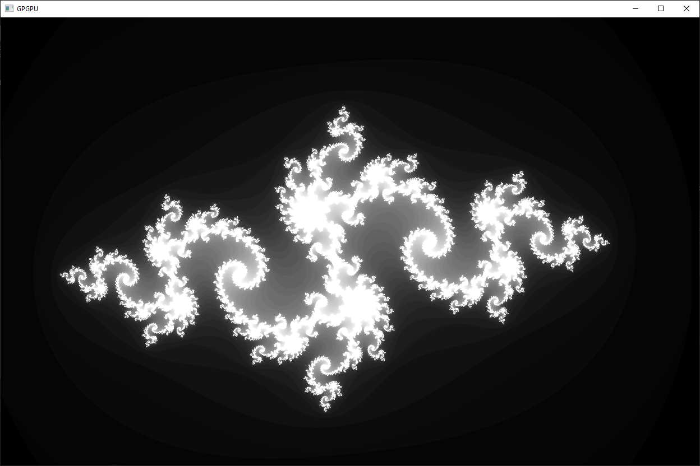
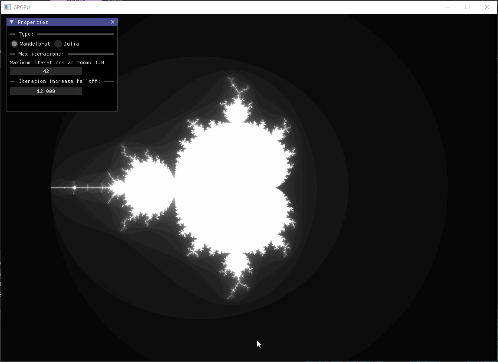

# Mandelbrot and Julia Set Renderer with CUDA, SDL, and ImGui

## Introduction

Embark on a visual journey into the Mandelbrot and Julia sets with this CUDA-accelerated C++ program. Harnessing the parallel computing capabilities of NVIDIA's CUDA architecture, SDL for graphics rendering, and ImGui for a dynamic user interface, this program provides an immersive and interactive exploration of intricate fractal landscapes.

## Features

- **Dynamic Visualization:** Explore the Mandelbrot and Julia sets dynamically by adjusting parameters such as zoom, pan, and iteration count through the intuitive ImGui user interface.
- **CUDA Acceleration:** Leverage the power of CUDA for efficient computation of complex fractal patterns, ensuring swift and responsive rendering on compatible NVIDIA GPUs.
- **SDL Rendering:** Utilize the SDL library for rendering the computed fractals, providing a cross-platform graphical display.
- **ImGui Integration:** Seamlessly interact with the program through ImGui, allowing users to set and manipulate fractal parameters in real-time.
- **Flexible Julia Set Rendering:** Set custom parameters for the Julia set, enabling exploration of a vast array of captivating fractal shapes.

## Usage

The program integrates ImGui for a user-friendly interface, making it easy to adjust visualization parameters on the fly. Compile the provided source code with a C++ compiler supporting CUDA, SDL, and ImGui. Experience the captivating landscapes of the Mandelbrot and Julia sets while dynamically tweaking parameters through the ImGui interface.

## System Requirements

- NVIDIA GPU with CUDA support
- CUDA Toolkit installed
- C++ compiler with CUDA support
- SDL library for graphics rendering
- ImGui library for dynamic user interface

## Getting Started

Follow the installation instructions, compile the source code, and run the program to launch the ImGui interface. Interactively manipulate the visualization parameters using the ImGui controls to explore different regions of the Mandelbrot and Julia sets. The program's modular design and ImGui integration provide a versatile platform for personalized exploration.

## Repository Structure

The program is structured into C++ classes encapsulating the rendering logic. CUDA kernels perform the parallel computation, while SDL handles the graphical rendering. ImGui provides an interactive user interface for seamless parameter adjustment. Explore and extend the codebase to tailor the visualizations to your preferences.